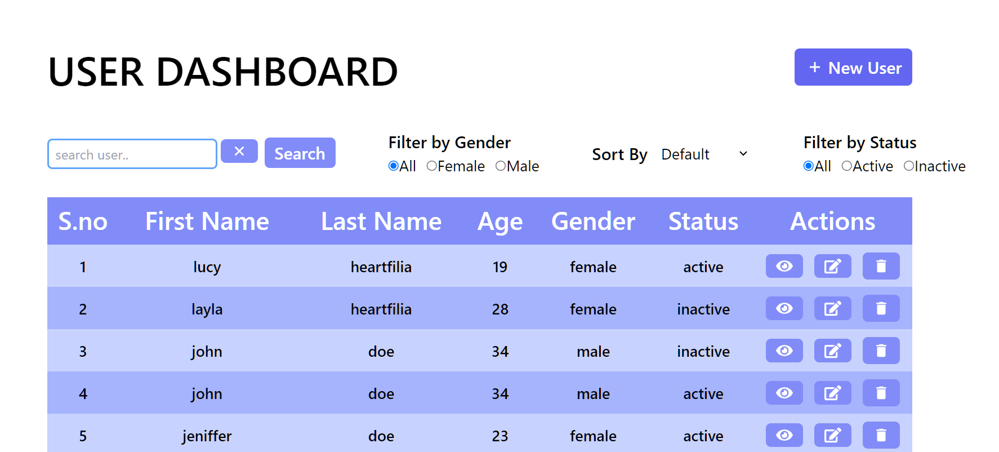
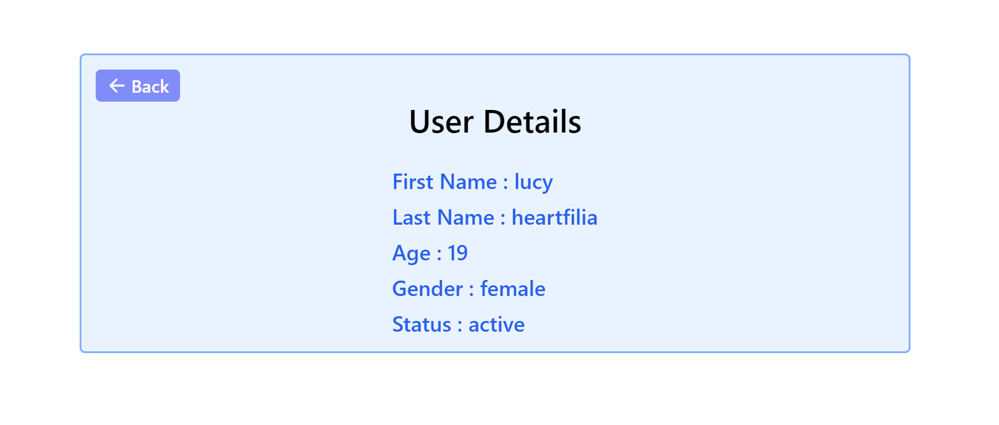
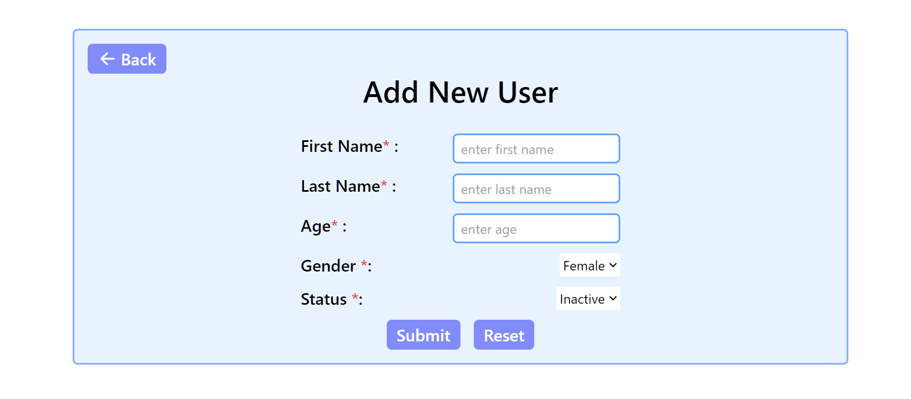
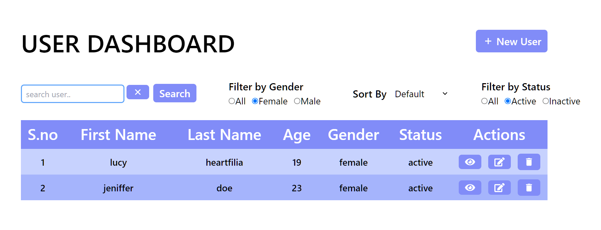
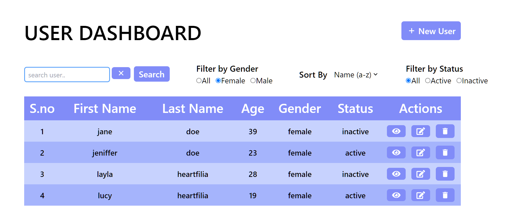
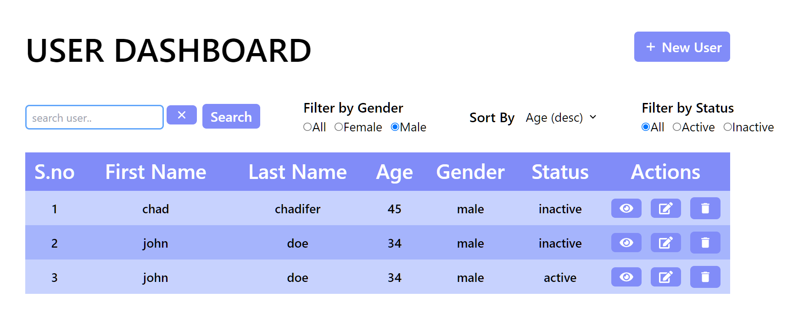
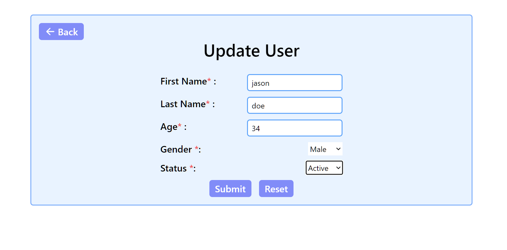

# User Management System

This is a simple user management system built using the MERN stack.

## Features

- Create, Read, Update, Delete (CRUD) operations on users.
- Search users by name.
- Filter users by gender (All, Male, Female).
- Filter users by status (All, Active, Inactive).
- Sort users by name or age in ascending or descending order.

## Screenshots

### User Dashboard

### See user Details

### Add User

### Filter User

### Sort User

### Update User

